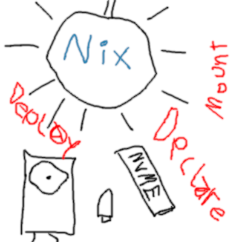

# disko - Declarative disk partitioning

## Table of Contents

- [README](../README.md)
- [Quickstart](./quickstart.md)
- [System Requirements](./requirements.md)
- [How to Guide](./HowTo.md)
- [Disko-Install](./disko-install.md)
- [Disko-Images](./disko-images.md)
- [Support Matrix](./supportmatrix.md)
- [Reference](./reference.md)
- [Upgrade Guide](./upgrade-guide.md)
  - [Migrating to the new GPT layout](./table-to-gpt.md)
