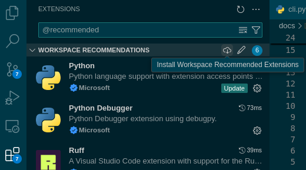
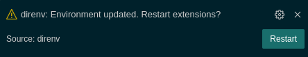
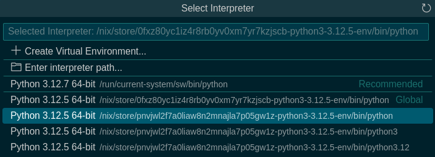

# Setting up your development environment

**This guide assumes you have flakes enabled.**

disko uses Nix flake's `devShells` output and [direnv](https://direnv.net/) to
set up the development environment in two ways.

The quickest way to get started is to run:

```
nix develop
```

However, if you use a shell other than bash, working inside `nix develop` might
get annoying quickly. An alternative is to use direnv, which sets up the
environment in your current shell session:

```console
# nix shell nixpkgs#direnv
direnv: error /home/felix/repos-new/temp/disko/.envrc is blocked. Run `direnv allow` to approve its content
# direnv allow
direnv: loading ~/repos-new/temp/disko/.envrc
direnv: using flake
direnv: export +AR +AS +CC +CONFIG_SHELL +CXX +HOST_PATH +IN_NIX_SHELL +LD +NIX_BINTOOLS +NIX_BINTOOLS_WRAPPER_TARGET_HOST_x86_64_unknown_linux_gnu +NIX_BUILD_CORES +NIX_BUILD_TOP +NIX_CC +NIX_CC_WRAPPER_TARGET_HOST_x86_64_unknown_linux_gnu +NIX_CFLAGS_COMPILE +NIX_ENFORCE_NO_NATIVE +NIX_HARDENING_ENABLE +NIX_LDFLAGS +NIX_STORE +NM +OBJCOPY +OBJDUMP +RANLIB +READELF +SIZE +SOURCE_DATE_EPOCH +STRINGS +STRIP +TEMP +TEMPDIR +TMP +TMPDIR +__structuredAttrs +buildInputs +buildPhase +builder +cmakeFlags +configureFlags +depsBuildBuild +depsBuildBuildPropagated +depsBuildTarget +depsBuildTargetPropagated +depsHostHost +depsHostHostPropagated +depsTargetTarget +depsTargetTargetPropagated +doCheck +doInstallCheck +dontAddDisableDepTrack +mesonFlags +name +nativeBuildInputs +out +outputs +patches +phases +preferLocalBuild +propagatedBuildInputs +propagatedNativeBuildInputs +shell +shellHook +stdenv +strictDeps +system ~PATH ~XDG_DATA_DIRS
```

You can now run `./disko2 dev --help` or `pytest` to confirm everything is working.

If you're working exclusively in the terminal, you're all set.

## IDE Integration

### VSCode

If you're using VSCode or any of its forks, you should install the recommended
extensions. You can find them in .vscode/extensions.json, searching for
`@recommended` in the Extensions Panel, or by opening the
command pallette and searching "Show Recommended Extensions".

You can then install all extensions in one click:



When you do this (and every time you open the repository again), the
[direnv extension](https://marketplace.visualstudio.com/items?itemName=mkhl.direnv)
will prompt you in the bottom right corner to restart all extensions once it
has loaded the development environment:



Click "Restart" to make all dependencies available to VSCode.

Afterwards, open the command pallette, search "Python: Select Interpreter" and
press Enter. The "Select Interpreter" dialog will open:



Do not select the interpreters tagged "Recommended" or "Global"! These will be
the ones installed on your system or currently selected in the extension.
Instead, pick one of the ones below them, this will be the latest available
package that includes the python packages specified in the `devShell`!

Now you're all set! You might want to also enable the "Format on Save" settings
and run the "Format Document" command once to select a formatter for each file
type.

Remember to go through these steps again whenever updating the flake.

### Other IDEs

These are just notes. Feel free to submit a PR that adds support and
documentation for other IDEs!

[Jetbrains Marketplace has two direnv extensions available](https://plugins.jetbrains.com/search?excludeTags=internal&search=direnv)

