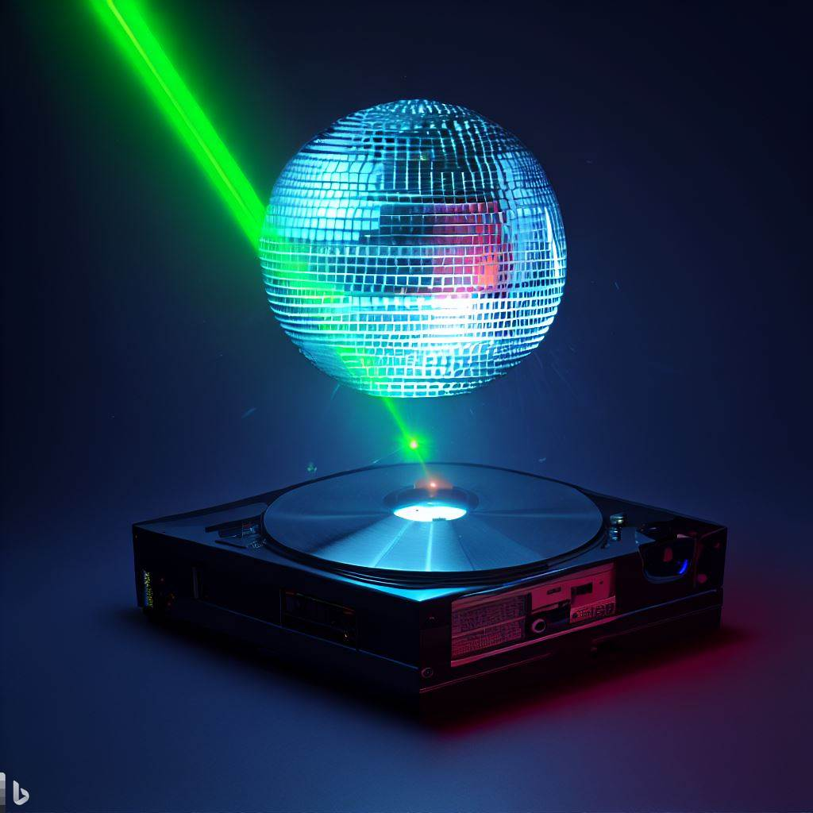

# disko - Declarative disk partitioning



[Documentation Index](./INDEX.md)

## Quickstart Guide

This tutorial describes how to install NixOS on a single disk system using
`disko`. You will also need to refer to the NixOS manual, which is available
[here.](https://nixos.org/manual/nixos/stable/index.html#ex-config)

Please note that `disko` will reformat the entire disk and overwrite any
existing partitions. Dual booting with other operating systems is not supported.

### Step 1: Choose a Disk Configuration

Real-world templates are provided in this
[repository](https://github.com/nix-community/disko-templates).

More disk layouts for all filesystems can be also found in the
[example](https://github.com/nix-community/disko/tree/master/example) directory
of disko. However these examples are also used for regression tests in disko and
may have uncommon options in them to fully exercise all features of disko, that
you may need to change or remove.

Decide which of these layouts best suits your requirements. If you're not sure
which layout to pick, use the
[single-disk-ext4](https://github.com/nix-community/disko-templates/blob/main/single-disk-ext4/disko-config.nix)
configuration. This layout is compatible with both BIOS and EFI systems.

Refer to the [reference manual](./reference.md) for more information about the
sample layouts and how to build your own configuration.

To copy a template use this command in your nixos configuration directory:

```
nix flake init --template github:nix-community/disko-templates#single-disk-ext4
```

This will write a file called `disko-config.nix` into the current directory.
Import this file in your NixOS configuration:

```nix
{
  imports = [ ./disko-config.nix ];
}
```

If you want to choose a layout from the disko example directory instead, you'll
need to make a note of the URL to the raw file. To do this, open the file in
Github. Immediately below the list of contributors, you will see a button
labelled 'RAW' near the right hand side. Click this. The URL of the raw file
will appear in the search bar of your browser. It will look something like this:

```
https://raw.githubusercontent.com/nix-community/disko/master/example/hybrid.nix
```

### Step 2: Boot the installer

Download the NixOS ISO image from the NixOS
[download page](https://nixos.org/download.html#nixos-iso), and create a
bootable USB drive following the instructions
in [Section 2.4.1 "Booting from a USB flash drive"](https://nixos.org/manual/nixos/stable/index.html#sec-booting-from-usb) of
the NixOS manual. Boot the machine from this USB drive.

### Step 3: Retrieve the disk name

Identify the name of your system disk by using the `lsblk` command as follows:

```console
lsblk
```

The output from this command will look something like this:

```
NAME        MAJ:MIN RM   SIZE RO TYPE MOUNTPOINTS
nvme0n1     259:0    0   1,8T  0 disk
```

In this example, an empty NVME SSD with 2TB space is shown with the disk name
"nvme0n1". Make a note of the disk name as you will need it later.

### Step 4: Copy the disk configuration to your machine

In Step 1, you chose a disk layout configuration from the
[examples directory](https://github.com/nix-community/disko/tree/master/example),
and made a note of its URL.

Your configuration needs to be saved on the new machine for example
as /tmp/disk-config.nix. You can do this using the `curl` command to download
from the url you noted above, using the `-o` option to save the file as
disk-config.nix. Your commands would look like this if you had chosen the hybrid
layout:

```console
cd /tmp
curl https://raw.githubusercontent.com/nix-community/disko/master/example/hybrid.nix -o /tmp/disk-config.nix
```

### Step 5: Adjust the device in the disk configuration

Inside the disk-config.nix the device needs to point to the correct disk name.

Open the configuration in your favorite editor i.e.:

```console
nano /tmp/disk-config.nix
```

Replace `<disk-name>` with the name of your disk obtained in Step 1.

```nix
# ...
main = {
  type = "disk";
  device = "<disk-name>";
  content = {
    type = "gpt";
# ...
```

### Step 6: Run disko to partition, format and mount your disks

The following step will partition and format your disk, and mount it to `/mnt`.

**Please note: This will erase any existing data on your disk.**

```console
sudo nix --experimental-features "nix-command flakes" run github:nix-community/disko -- --mode disko /tmp/disk-config.nix
```

After the command has run, your file system should have been formatted and
mounted. You can verify this by running the following command:

```console
mount | grep /mnt
```

The output should look like this if your disk name is `nvme0n1`.

```
/dev/nvme0n1p1 on /mnt type ext4 (rw,relatime,stripe=2)
/dev/nvme0n1p2 on /mnt/boot type vfat (rw,relatime,fmask=0022,dmask=0022,codepage=437,iocharset=iso8859-1,shortname=mixed,errors=remount-ro)
```

### Step 7: Complete the NixOS installation.

Your disks have now been formatted and mounted, and you are ready to complete
the NixOS installation as described in the
[NixOS manual](https://nixos.org/manual/nixos/stable/index.html#sec-installation) -
see the section headed "**Installing**", Steps 3 onwards. However, you will need
to include the partitioning and formatting configurations that you copied into
`/tmp/disk-config.nix` in your configuration, rather than allowing NixOS to
generate information about your file systems. When you are configuring the
system as per Step 4 of the manual, you should:

a) Include the `no-filesystems` switch when using the `nixos-generate-config`
command to generate an initial `configuration.nix`. You will be supplying the
file system configuration details from `disk-config.nix`. Your CLI command to
generate the configuration will be:

```console
nixos-generate-config --no-filesystems --root /mnt
```

This will create the file `configuration.nix` in `/mnt/etc/nixos`.

b) Move the `disko` configuration to /etc/nixos

```console
mv /tmp/disk-config.nix /mnt/etc/nixos
```

c) You can now edit `configuration.nix` as per your requirements. This is
described in Step 4 of the manual. For more information about configuring your
system, refer to the NixOS manual.
[Chapter 6, Configuration Syntax](https://nixos.org/manual/nixos/stable/index.html#sec-configuration-syntax)
describes the NixOS configuration syntax, and
[Appendix A, Configuration Options](https://nixos.org/manual/nixos/stable/options.html)
gives a list of available options. You can find also find a minimal example of a
NixOS configuration in the manual:
[Example: NixOS Configuration](https://nixos.org/manual/nixos/stable/index.html#ex-config).

d) When editing `configuration.nix`, you will need to add the `disko` NixOS
module and `disk-config.nix` to the imports section. This section will already
include the file `./hardware-configuration.nix`, and you can add the new entries
just below this. This section will now include:

```nix
imports =
 [ # Include the results of the hardware scan.
   ./hardware-configuration.nix
   "${builtins.fetchTarball "https://github.com/nix-community/disko/archive/master.tar.gz"}/module.nix"
   ./disk-config.nix
 ];
```

e) If you chose the hybrid-partition scheme, then choose `grub` as a bootloader,
otherwise follow the recommendations in Step 4 of the **Installation** section
of the NixOS manual. The following configuration for `grub` works for both EFI
and BIOS systems. Add this to your configuration.nix, commenting out the
existing lines that configure `systemd-boot`. The entries will look like this:

**Note:** Its not necessary to set `boot.loader.grub.device` here, since Disko
will take care of that automatically.

```nix
# ...
   #boot.loader.systemd-boot.enable = true;
   #boot.loader.efi.canTouchEfiVariables = true;
   boot.loader.grub.enable = true;
   boot.loader.grub.efiSupport = true;
   boot.loader.grub.efiInstallAsRemovable = true;
# ...
```

f) Finish the installation and reboot your machine,

```console
nixos-install
reboot
```
